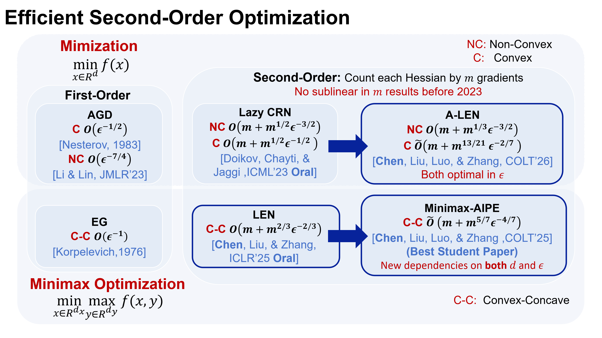

## News

* (2026/1) A-LEN [3] was accepted by COLT'26.
* (2025/7) Minimax-AIPE [2] was accepted by COLT'25 and got **Best Student Paper**!
* (2025/4) LEN [1] was accected by ICLR'25 and got **Oral** presentation (top 1.8%).

## Reference

* [1] **Lesi Chen**, Chengchang Liu, and Jingzhao Zhang, _Second-Order Min-Max Optimization with Lazy Hessians_ [[ICLR 2025]](https://arxiv.org/pdf/2410.09568)
* [2] **Lesi Chen**, Chengchang Liu, Luo Luo, and Jingzhao Zhang, _Solving Convex-Concave Problems with_ $\tilde{\mathcal{O}}(\epsilon^{-4/7})$ _Second-Order Oracle Complexity_  [[COLT 2025]](http://arxiv.org/abs/2506.08362)
* [3] **Lesi Chen**, Chengchang Liu, Luo Luo, and Jingzhao Zhang, _Faster Newton Methods for Convex and Nonconvex Optimization in Gradient Complexity_ [[COLT 2026]](https://arxiv.org/abs/2501.17488)

